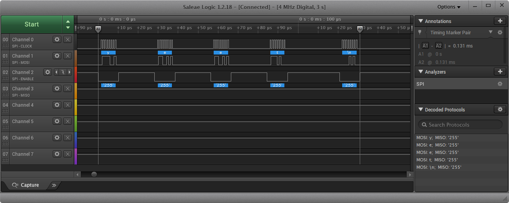

Name: Shaw-Iong Hsueh

EID: sh48926

Team Number: F2

## Questions

1. Why does your program need a setup and a loop?

    The setup initializes the pins as inputs/output, and initializes the things that only take one step.

2. What is the downside to putting all your code in a loop?

    Putting all the code in a loop means that it will always run, so if there is something that only needs to be run once it will need an alternative method to be implemented. 

3. Why does your code need to be compiled?

    To convert the C code to machine language for the Arduino

4. When lowering the frequency in procedure A, step 4, what is going wrong? Brainstorm some solutions. Dimmers exist in the real world. What is their solution?

    When the frequency goes down, the LED starts to flash much more noticeably because the duty cycle in which the LED is off lasts for much longer. To combat this, they could increase the frequency so that the flash is not noticeable to the human eye. They could also use capacitors to smooth out the voltage. 

5. Why do you need to connect the logic analyzer ground to the ESP32 ground?

    So that the logic analyzer would have the same reference voltage.

6. What is the difference between synchronous and asynchronous communication?

    Synchronous communication requres an external clock to synchronize the timing of communication between two or more devices, while asynchronous are synchronized by special signals along the transmission line. 

7. Profile of UART: Sent X bytes in Y time 
    
    Sent "yeet" (5 bytes) in 0.9513 ms

8. Profile of SPI: Sent X bytes in Y time

    Sent "yeet" (5 bytes) in 0.131 ms

9. Why is SPI so much faster than UART?

    The clock is already set, so it doesn't waste time initializing the clock through the transmission signal. It can automatically go to reading what the message is

10. list one pro and one con of UART

    Pro: Less pins are used
    Con: Slower than other communications

11. list one pro and one con of SPI

    Pro: Less prone to interference because of clock pin
    Con: Requires more pins to interface

12. list one pro and one con of I2C

    Pro: Requires less only 2 signal wires to interface
    Con: Slower communication speeds and much more senstive to interference

13. Why does I2C need external resistors to work?

    It uses external resistors as an pull up or pull down resistors to the logic signal. 

## Screenshots

Procedure A, step 1:

Procedure A, step 4:

Procedure B, UART:

Procedure B, SPI:

